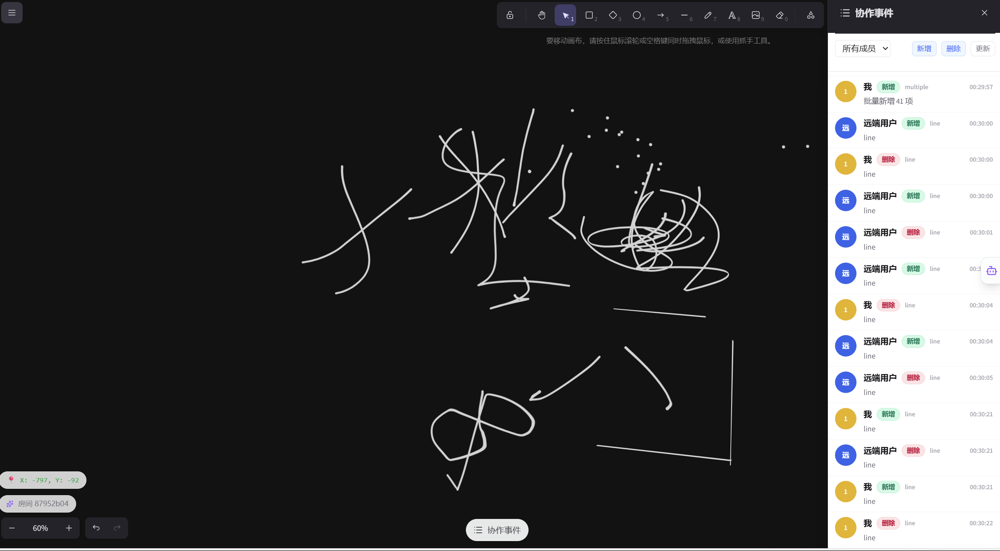

## 请阅读并填写以下内容

1. - [ ] 本地已执行ruff check
2. - [ ] 允许将相关代码推到dev分支而非master分支
3. 本次修改的功能为:
   - [ ] Bug 修复
   - [协作事件流 ] 新功能
4. - [是] 本地已执行测试
5. - [ ] 如有破坏性更新请说明原因

## 描述
在画布左侧增加了桌面端按钮，点击在右侧显示协作事件流谁在何时新增/删除/更新了元素，包含元素类型（矩形/文本/箭头等）与简短摘要。
支持按成员筛选、按事件类型过滤；新事件来到时轻微滚动提示。
<!-- 请简要描述此 PR 的更改内容 -->
## 附图

## 关联 Issue
后端若能提供 clientId→用户名映射，可在 Yjs 事件里填充真实远端用户名
我自己尝试的登两个不同的账号在一个房间里面画图有bug，画上去之后会立即消失，在事件流里面显示的是新增后马上删除。
<!-- 如果有关联的 Issue，请在此处链接 -->
Closes #
