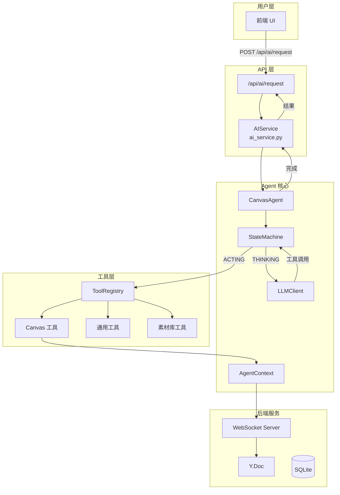
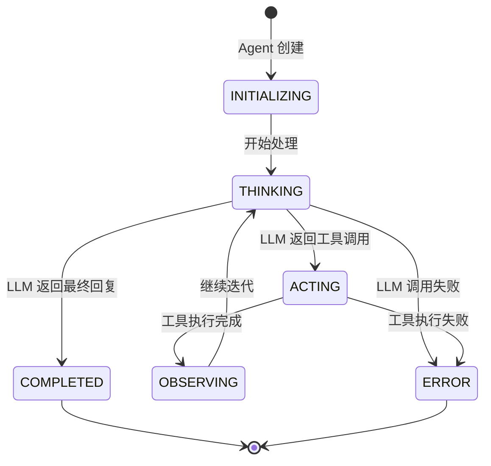
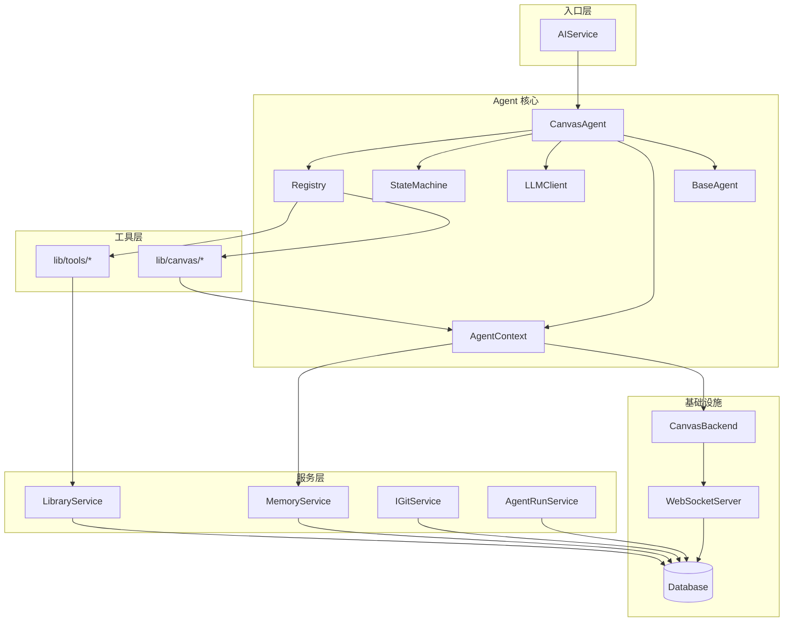
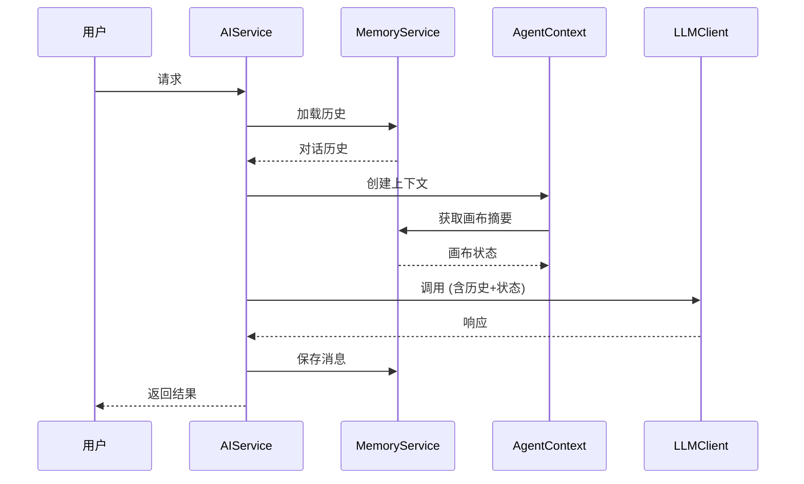

## 本次重构变更 (Commit Summary)

### 主要变更

**迁移与重组**:
- `agent/tools/*` → `agent/lib/canvas/` + `agent/lib/tools/`
- `services/agent_runs.py` → `agent/core/runs.py`
- `services/library.py` → `agent/lib/library/service.py`
- `services/version_control.py` → `agent/lib/version_control/service.py`
- `agent/canvas/backend.py` → `agent/core/backend.py`
- `utils/async_task.py` → `agent/lib/utils/async_task.py`

**新增模块**:
- `agent/memory/` - Agent 记忆服务（对话历史、画布状态）
- `agent/lib/utils/` - 通用工具函数（文本、JSON、时间处理）

**删除文件**:
- `agent/tools/` 整个目录（迁移到 lib/）
- `services/library.py`, `services/version_control.py`（迁移）
- `routers/version_control/` 目录（合并为单文件）

---

## Agent 执行循环



### 状态机流程



---

## 目录结构

```
src/agent/
├── __init__.py              # 模块入口，导出核心组件
├── core/                    # 核心基础设施
│   ├── __init__.py
│   ├── base.py              # BaseAgent, CanvasAgent, PlanningAgent
│   ├── context.py           # AgentContext, AgentMetrics, AgentStatus
│   ├── backend.py           # CanvasBackend (WebSocket 集成)
│   ├── registry.py          # ToolRegistry, @registry.register
│   ├── llm.py               # LLMClient, LLMResponse
│   ├── state.py             # AgentStateMachine, AgentState
│   ├── errors.py            # AgentError, ToolError, LLMError
│   ├── retry.py             # RetryPolicy, ErrorRecoveryManager
│   └── runs.py              # AgentRunService (运行记录)
│
├── canvas/                  # 画布模块 (兼容层)
│   └── __init__.py          # 重新导出 core.backend 和 lib.canvas.layout
│
├── memory/                  # 记忆服务
│   ├── __init__.py
│   ├── service.py           # MemoryService (对话历史)
│   └── canvas_state.py      # CanvasStateProvider (画布状态)
│
├── prompts/                 # Prompt 模板系统
│   ├── __init__.py
│   ├── base.py              # PromptTemplate 基类
│   ├── manager.py           # PromptManager
│   ├── system.py            # SystemPrompt
│   ├── history.py           # HistoryContext
│   └── reflection.py        # SelfReflection
│
└── lib/                     # 工具库
    ├── __init__.py
    ├── canvas/              # 画布工具
    │   ├── __init__.py
    │   ├── schemas.py       # Pydantic 模型
    │   ├── helpers.py       # 辅助函数
    │   ├── layout.py        # 布局引擎
    │   ├── canvas.py        # get_canvas_bounds
    │   ├── elements.py      # 元素 CRUD 工具
    │   └── flowchart.py     # 流程图工具
    │
    ├── tools/               # 通用工具
    │   ├── __init__.py
    │   ├── general_tools.py # get_current_time, calculate
    │   ├── web_tools.py     # fetch_webpage
    │   └── library.py       # 素材库操作
    │
    ├── library/             # 素材库服务
    │   ├── __init__.py
    │   ├── models.py        # Library, LibraryItem
    │   └── service.py       # LibraryService
    │
    ├── version_control/     # 版本控制
    │   ├── __init__.py
    │   ├── models.py        # CommitInfo, HistoryResponse
    │   ├── service.py       # IGitService
    │   └── utils.py         # 工具函数
    │
    └── utils/               # 工具函数
        ├── __init__.py
        ├── text.py          # truncate_text, sanitize_text
        ├── json_utils.py    # safe_json_loads, extract_json_from_text
        ├── time_utils.py    # timestamp_ms, relative_time
        └── async_task.py    # AsyncTask, AsyncTaskManager
```

---

## 工具清单 (20 个)

### Canvas 工具 (17 个)

| 工具名 | 位置 | 功能 |
|--------|------|------|
| `get_canvas_bounds` | `lib/canvas/canvas.py` | 获取画布边界和元素统计 |
| `create_element` | `lib/canvas/elements.py` | 创建单个 Excalidraw 元素 |
| `list_elements` | `lib/canvas/elements.py` | 列出画布上的所有元素 |
| `get_element` | `lib/canvas/elements.py` | 获取指定元素详情 |
| `update_element` | `lib/canvas/elements.py` | 更新元素属性 |
| `delete_elements` | `lib/canvas/elements.py` | 删除指定元素 |
| `clear_canvas` | `lib/canvas/elements.py` | 清空画布 |
| `batch_create_elements` | `lib/canvas/elements.py` | 批量创建元素 |
| `auto_layout_create` | `lib/canvas/elements.py` | 自动布局创建流程图 |
| `group_elements` | `lib/canvas/elements.py` | 将元素编组 |
| `ungroup_elements` | `lib/canvas/elements.py` | 取消元素编组 |
| `create_flowchart_node` | `lib/canvas/flowchart.py` | 创建流程图节点 |
| `connect_nodes` | `lib/canvas/flowchart.py` | 连接两个节点 |
| `list_libraries` | `lib/tools/library.py` | 列出素材库 |
| `search_library_items` | `lib/tools/library.py` | 搜索素材 |
| `import_remote_library` | `lib/tools/library.py` | 导入远程素材库 |
| `insert_library_item` | `lib/tools/library.py` | 插入素材到画布 |

### General 工具 (2 个)

| 工具名 | 位置 | 功能 |
|--------|------|------|
| `get_current_time` | `lib/tools/general_tools.py` | 获取当前时间 |
| `calculate` | `lib/tools/general_tools.py` | 数学计算 |

### Web 工具 (1 个)

| 工具名 | 位置 | 功能 |
|--------|------|------|
| `fetch_webpage` | `lib/tools/web_tools.py` | 抓取网页内容 |

---

## 组件依赖关系



---

## 数据流

### 用户请求处理流程

1. **用户输入** → `/api/ai/request`
2. **AIService** 创建 `AgentContext`
3. **CanvasAgent.run()** 开始执行
4. **StateMachine** 管理状态转换
5. **LLMClient** 调用大模型
6. **Registry** 执行工具调用
7. **工具** 通过 `AgentContext` 操作画布
8. **CanvasBackend** 同步到 Y.Doc
9. **WebSocket** 广播到所有客户端
10. **返回结果** 给用户

### 记忆系统



---

## 配置

### 关键配置项

| 配置项 | 位置 | 说明 |
|--------|------|------|
| `LLM_API_KEY` | `.env` | LLM API 密钥 |
| `LLM_API_BASE` | `.env` | LLM API 地址 |
| `LLM_MODEL` | `.env` | 默认模型名称 |
| `max_iterations` | `AgentConfig` | 最大迭代次数 (默认 10) |
| `max_tokens` | `AgentConfig` | 最大 token 数 |
| `temperature` | `AgentConfig` | 生成温度 (默认 0.7) |

---

## 扩展指南

### 添加新工具

1. 在 `lib/tools/` 或 `lib/canvas/` 创建文件
2. 使用 `@registry.register()` 装饰器注册
3. 确保在 `__init__.py` 中导入

```python
from src.agent.core.registry import registry, ToolCategory

@registry.register(
    name="my_tool",
    description="工具描述",
    category=ToolCategory.GENERAL,
)
async def my_tool(ctx: AgentContext, param: str) -> dict:
    return {"status": "success"}
```

### 添加新服务

1. 在 `lib/` 下创建目录
2. 创建 `models.py` (数据模型) 和 `service.py` (业务逻辑)
3. 在 `__init__.py` 中导出
